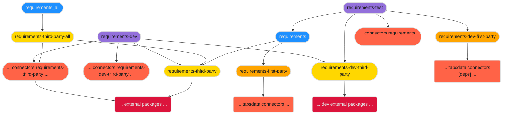

<!--
    Copyright 2025 Tabs Data Inc.
-->

```mermaid
flowchart TD
    requirements(["requirements"]):::requirements
    requirements-all(["requirements_all"]):::requirements

    requirements-dev(["requirements-dev"]):::requirements-dev    
    requirements-test(["requirements-test"]):::requirements-test
    
    requirements-third-party-connectors(["... connectors requirements-third-party ..."]):::requirements-third-party-connectors
    requirements-dev-third-party-connectors(["... connectors requirements-dev-third-party ..."]):::requirements-dev-third-party-connectors
    
    requirements-third-party(["requirements-third-party"]):::requirements-third-party
    requirements-first-party(["requirements-first-party"]):::requirements-first-party
    
    requirements-third-party-all(["requirements-third-party-all"]):::requirements-third-party-all
    
    requirements-dev-first-party(["requirements-dev-first-party"]):::requirements-dev-first-party
    requirements-dev-third-party(["requirements-dev-third-party"]):::requirements-dev-third-party
    
    tabsdata-connectors("... tabsdata connectors ..."):::tabsdata-connectors    
    external-packages("... external packages ..."):::external-packages

    tabsdata-connectors-deps("... tabsdata connectors [deps] ..."):::tabsdata-connectors
    external-packages-dev("... dev external packages ..."):::external-packages

    requirements-connectors(["... connectors requirements ..."]):::requirements-connectors
   
    requirements --> requirements-first-party
    requirements --> requirements-third-party
    requirements-first-party --> tabsdata-connectors
    requirements-third-party --> external-packages

    requirements-all --> requirements-third-party-all
    requirements-third-party-all --> requirements-third-party
    requirements-third-party-all --> requirements-third-party-connectors
    requirements-third-party-connectors --> external-packages
    
    requirements-test --> requirements
    requirements-test --> requirements-connectors
    requirements-test --> requirements-dev-first-party
    requirements-test --> requirements-dev-third-party
    requirements-dev-first-party --> tabsdata-connectors-deps
    requirements-dev-third-party --> external-packages-dev   

    requirements-dev --> requirements-third-party
    requirements-dev --> requirements-dev-third-party
    requirements-dev --> requirements-third-party-connectors
    requirements-dev --> requirements-dev-third-party-connectors
    
    classDef requirements fill:#1E90FF,stroke:#E0E0E0,stroke-width:2px,color:#E0E0E0;
    classDef requirements-all fill:#1E90FF,stroke:#E0E0E0,stroke-width:2px,color:#E0E0E0;
    classDef requirements-test fill:#9370DB,stroke:#E0E0E0,stroke-width:2px,color:#1E1E1E;
    classDef requirements-dev fill:#9370DB,stroke:#E0E0E0,stroke-width:2px,color:#1E1E1E;    
    classDef requirements-first-party fill:#FFA500,stroke:#E0E0E0,stroke-width:2px,color:#1E1E1E;   
    classDef requirements-third-party fill:#FFD700,stroke:#E0E0E0,stroke-width:2px,color:#1E1E1E;
    classDef requirements-third-party-all fill:#FFD700,stroke:#E0E0E0,stroke-width:2px,color:#1E1E1E;    
    classDef requirements-dev-first-party fill:#FFA500,stroke:#E0E0E0,stroke-width:2px,color:#1E1E1E;
    classDef requirements-dev-third-party fill:#FFD700,stroke:#E0E0E0,stroke-width:2px,color:#1E1E1E;    
    classDef tabsdata-connectors fill:#FF6347,stroke:#E0E0E0,stroke-width:2px,color:#1E1E1E;
    classDef external-packages fill:#DC143C,stroke:#E0E0E0,stroke-width:2px,color:#E0E0E0;
    classDef requirements-connectors fill:#FF6347,stroke:#E0E0E0,stroke-width:2px,color:#1E1E1E;
    classDef requirements-third-party-connectors fill:#FF6347,stroke:#E0E0E0,stroke-width:2px,color:#1E1E1E;    
    classDef requirements-dev-third-party-connectors fill:#FF6347,stroke:#E0E0E0,stroke-width:2px,color:#1E1E1E;    
    classDef tabsdata-connectors-deps fill:#FF6347,stroke:#E0E0E0,stroke-width:2px,color:#1E1E1E;
    classDef external-packages-dev fill:#DC143C,stroke:#E0E0E0,stroke-width:2px,color:#E0E0E0;    
    
```